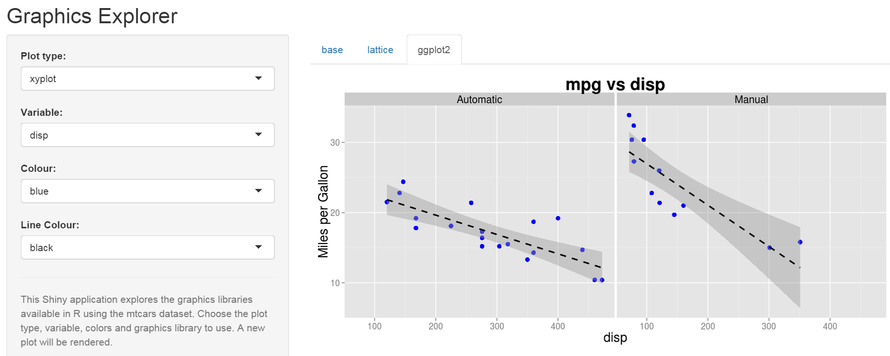
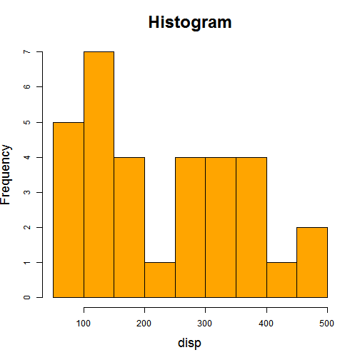
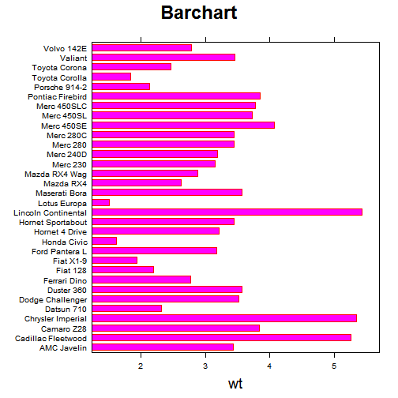
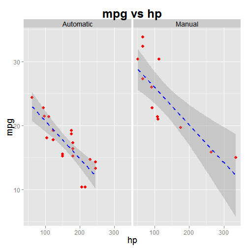

Graphics Explorer
========================================================
author: SK Tan
date: 21 Mar 2015

Graphics Explorer
========================================================

**Shiny** app to explore graphics libraries in R

- base graphics
- lattice graphs
- ggplot2 graphs


<http://sktan.shinyapps.io/shinyapp/>

Screen shot
========================================================




Base graphics
========================================================
left: 55%


```r
require(graphics)
attach(mtcars)
hist(disp,
     xlab="disp",
     col="orange",
     border="black",
     main="Histogram",
     cex.lab=1.5,
     cex.axis=1,
     cex.main=2)
```

***
 

Lattice graphs
========================================================
left: 55%

```r
library(lattice)
barchart(
model~wt,
col="magenta",
border="red",
cex.names=0.7,
main=list("Barchart",
      cex=2),
xlab=list(label="wt",
      cex=1.5))
```

***
 

ggplot2 graphs
========================================================
left: 55%


```r
library(ggplot2)
print(
ggplot(df,
   aes(x=hp,y=mpg))+
geom_point(
   color="red",
   size=3)+ 
geom_smooth(
    method="lm",
    color="blue",
    linetype=2)+
facet_grid(.~am.f)+
labs(x="hp")+ 
labs(y="mpg")+ 
labs(title="mpg vs hp")
```

***
 
